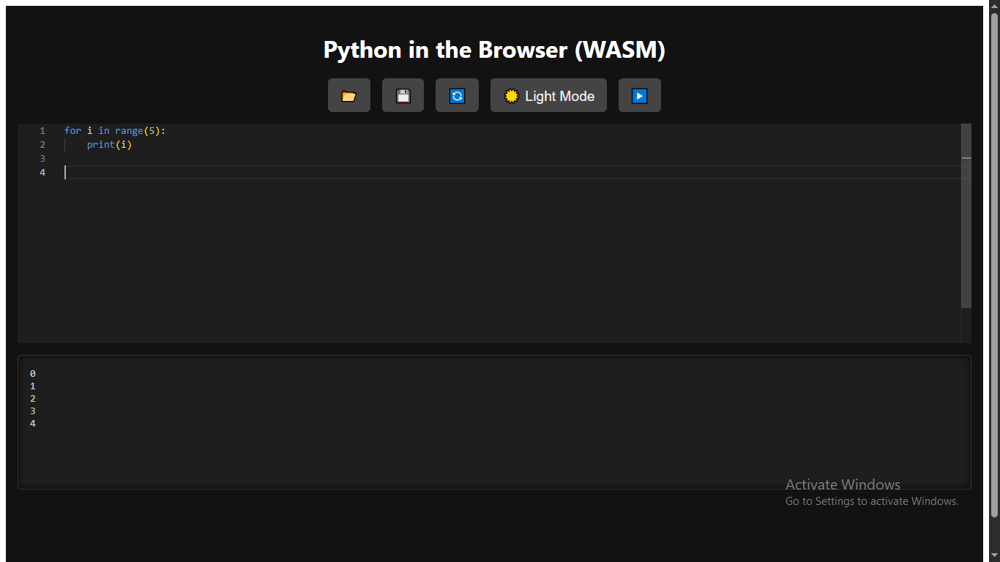

# Python in the Browser (WASM) React App

This is a React application that lets you write, run, and save Python code directly in your browser using [Pyodide](https://pyodide.org/), a WebAssembly-based Python runtime.

---

## Features

- Write Python code in a browser-based code editor.
- Run Python code with output displayed instantly.
- Load Python code from local files (`.py`, `.txt`).
- Save your Python code as a `.py` file.
- Reset the editor to default sample code.
- Dark mode support for comfortable coding.

---

## Demo

  
---

## Installation

1. Clone this repo:

   ```bash
   git clone https://github.com/yourusername/python-browser-wasm.git
   cd python-browser-wasm

2. Install dependencies:

   ```bash
   npm install

3. Run the app locally:

  ```bash
  npm start

---

4. Open your browser and navigate to `http://localhost:3000`